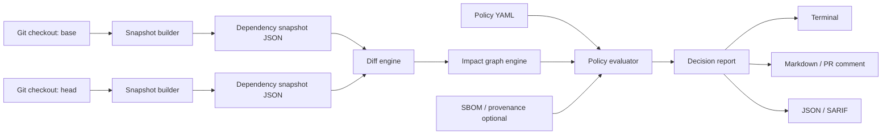
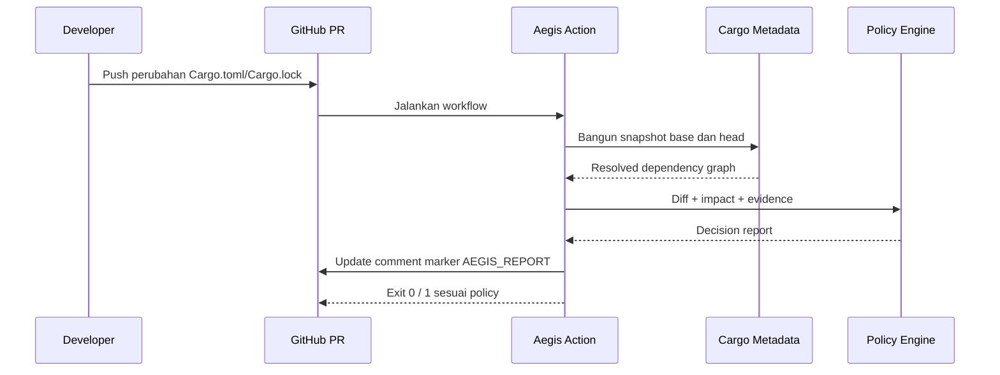

# Aegis Chain

> **PRD, blueprint arsitektur, dan rencana implementasi untuk proyek open-source Rust.**  
> **Versi dokumen:** 0.1.0  
> **Status:** Siap diimplementasikan secara bertahap di OpenCode  
> **Penulis:** Manus AI  
> **Bahasa dokumen:** Indonesia

---

## 1. Ringkasan satu kalimat

**Aegis Chain adalah CLI dan GitHub Action yang membaca perubahan dependency sebuah Rust workspace, membangun graph dampak, lalu menghasilkan laporan manusiawi tentang package yang berubah, komponen lokal yang terdampak, bukti supply-chain yang belum lengkap, dan keputusan policy yang direkomendasikan.**

Nama *Aegis* berarti perisai. Dalam proyek ini, perisai tersebut bukan “scanner CVE baru”, melainkan **lapisan penjelasan dan pengambilan keputusan** di atas perubahan dependency.

---

## 2. Masalah yang diselesaikan

Sebuah proyek Rust nyata memakai banyak crate pihak ketiga. Ketika sebuah pull request mengubah `Cargo.toml`, `Cargo.lock`, atau file SBOM, reviewer perlu menjawab beberapa pertanyaan penting: dependency apa yang berubah, apakah perubahan itu masuk ke service yang penting, seberapa jauh dampaknya, serta apakah bukti provenance atau SBOM yang dibutuhkan sudah tersedia.

Tool yang sudah ada sering menjawab salah satu bagian kecil—misalnya daftar CVE atau daftar package—tetapi tidak menyatukan **perubahan → graph dependency → workspace package → policy keputusan**. Aegis Chain mengisi celah tersebut dengan laporan yang dapat dibaca reviewer tanpa meminta mereka memahami seluruh dependency tree secara manual.

| Tanpa Aegis Chain | Dengan Aegis Chain |
| --- | --- |
| “`reqwest` berubah dari 0.12.1 menjadi 0.12.2.” | “`reqwest` berubah, lalu berdampak pada `api-gateway`, `payment-worker`, dan `notification-service`.” |
| “Ada 1 dependency baru.” | “Dependency baru memasuki jalur service yang ditandai `critical`; policy meminta SBOM atau approval maintainer.” |
| “Ada CVE severity high.” | “Ada finding high; 4 package workspace dapat mencapai dependency tersebut; rilis diblokir karena policy `critical-path`.” |

Cargo menyediakan output metadata JSON dengan informasi workspace dan graph dependency yang telah di-resolve; output ini merupakan sumber fakta utama Aegis Chain pada fase awal.[1] CycloneDX menyediakan model untuk komponen, dependency, layanan, serta relasi supply chain, sehingga cocok menjadi format SBOM awal.[2]

---

## 3. Tujuan produk dan batasan

### 3.1 Tujuan utama

Aegis Chain harus membuat review perubahan dependency **lebih cepat, lebih jelas, dan dapat diaudit**. Pada MVP, pengguna cukup menjalankan satu perintah atau satu GitHub Action untuk memperoleh *impact report* yang menjawab empat pertanyaan: apa yang berubah, siapa yang terdampak, bukti apa yang hilang, dan apakah policy lulus.

### 3.2 Non-tujuan pada MVP

MVP **tidak** mencoba menjadi vulnerability database, package registry, security information platform, dashboard SaaS, atau dependency resolver pengganti Cargo. Aegis Chain juga tidak mengklaim bisa menentukan apakah package “aman”; ia hanya mengolah fakta yang tersedia dan mengeluarkan keputusan policy yang eksplisit.

| Termasuk MVP | Tidak termasuk MVP |
| --- | --- |
| Rust workspace dan `Cargo.lock` | Bahasa package manager lain seperti npm, Maven, Go modules |
| Analisis offline/local-first | Upload source code ke server Aegis |
| Diff dua snapshot dependency | Dashboard web multi-tenant |
| Policy YAML sederhana | Bahasa policy kompleks atau policy engine penuh |
| Markdown, JSON, dan SARIF output | Auto-merge atau auto-fix dependency |
| GitHub Action advisory/blocking | Scanner CVE mandiri dari nol |

### 3.3 Persona pengguna

| Persona | Masalah | Nilai yang diterima |
| --- | --- | --- |
| Rust maintainer | PR dependency sulit direview dengan cepat. | Ringkasan perubahan dan jalur dampak dalam komentar PR. |
| Platform/security engineer | Perlu policy bukti yang konsisten sebelum release. | Policy gate yang deterministik dan dapat diaudit. |
| Contributor open source | Belum paham dependency tree project besar. | Penjelasan graph dalam istilah package workspace. |
| Release manager | Perlu tahu kapan rilis harus ditahan. | Status `pass`, `warn`, atau `block` beserta alasan. |

---

## 4. Prinsip desain

> **Jangan hanya memberitahu bahwa sesuatu berubah. Jelaskan mengapa perubahan itu penting.**

| Prinsip | Implementasi praktis |
| --- | --- |
| Local-first | Semua analisis MVP berjalan di mesin pengguna atau GitHub Runner; source code tidak dikirim ke server eksternal. |
| Explainable by default | Setiap status `warn` atau `block` wajib memiliki aturan policy, evidence, dan path graph yang menjelaskan keputusan. |
| Cargo sebagai source of truth | Gunakan `cargo metadata --format-version 1 --locked` untuk graph resolved; jangan mem-parsing lockfile bila metadata Cargo tersedia. |
| Fail closed hanya bila diminta | Default mode adalah advisory. Blocking terjadi hanya saat policy mengatur threshold/requirement secara eksplisit. |
| Deterministik | Input snapshot dan policy yang sama harus menghasilkan report dan exit code yang sama. |
| Small composable core | Parsing, graph, policy, scoring, render, dan integrasi GitHub dipisahkan menjadi crate/modul berbeda. |
| Tidak membuat klaim keamanan berlebihan | “Tidak ada finding” berarti “tidak ada finding pada sumber yang dipakai”, bukan “aman”. |

---

## 5. Product requirements document (PRD)

### 5.1 User story utama

| ID | User story | Acceptance criteria |
| --- | --- | --- |
| US-01 | Sebagai maintainer, saya ingin membandingkan dependency pada dua commit. | `aegis diff --base <rev> --head <rev>` menghasilkan daftar added, removed, upgraded, downgraded, dan source-changed package. |
| US-02 | Sebagai reviewer, saya ingin mengetahui package workspace yang terdampak. | Setiap package berubah menampilkan reverse dependency path ke root package workspace. |
| US-03 | Sebagai security engineer, saya ingin menulis policy sederhana. | File YAML dapat mewajibkan SBOM, melindungi package `critical`, dan menentukan threshold `warn`/`block`. |
| US-04 | Sebagai release manager, saya ingin status mesin. | CLI mengeluarkan JSON dan exit code stabil untuk `pass`, `warn`, dan `block`. |
| US-05 | Sebagai pengguna GitHub, saya ingin report otomatis di PR. | Action mem-post atau meng-update satu comment marker idempotent pada pull request. |
| US-06 | Sebagai contributor, saya ingin men-debug keputusan. | Flag `--explain <rule-id>` menunjukkan input, predicate, path, dan policy yang membentuk keputusan. |

### 5.2 Output yang wajib tersedia

| Format | Konsumen | Fungsi |
| --- | --- | --- |
| Terminal human-readable | Developer lokal | Membaca ringkasan saat menjalankan CLI. |
| Markdown | GitHub Pull Request | Review report yang mudah dipahami manusia. |
| JSON versioned | CI/tool lain | Integrasi otomatis dan snapshot test. |
| SARIF | GitHub Code Scanning | Annotation keamanan yang standar. |
| Evidence bundle JSON | Audit/reproducibility | Menyimpan snapshot, policy hash, hasil evaluasi, dan versi tool. |

### 5.3 Kriteria sukses MVP

MVP dianggap berhasil bila sebuah Rust workspace dapat dianalisis secara offline, dua commit dapat dibandingkan, dependency yang berubah dapat ditelusuri ke package workspace terdampak, policy YAML dapat mengeluarkan status, dan report dapat dipublikasikan dalam GitHub Action. Pengukuran awal bukan jumlah install, melainkan **berapa PR dependency yang report-nya dapat dimengerti reviewer tanpa membuka graph manual**.

---

## 6. Arsitektur tingkat tinggi



Sistem dibagi dalam enam lapisan. **Snapshot builder** menjalankan Cargo dan membaca metadata resolved. **Diff engine** membandingkan identity package di snapshot base dan head. **Impact graph engine** mencari reverse reachability dari package berubah menuju workspace member. **Policy evaluator** mengubah aturan YAML menjadi predicate deterministik. Terakhir, **report layer** merender satu `DecisionReport` ke berbagai format.

### 6.1 Boundary keamanan

| Boundary | Aturan |
| --- | --- |
| Source code repository | Aegis hanya membutuhkan manifest/lockfile/metadata; jangan membaca file source kecuali fitur khusus di masa depan. |
| Network | `--offline` dan `--locked` menjadi default pada analisis CI; fetching advisories/provenance merupakan plugin eksplisit. |
| Credentials GitHub | Action hanya meminta permission minimum `pull-requests: write` bila posting comment diaktifkan. |
| Policy file | Policy diperlakukan sebagai konfigurasi tepercaya milik repository; parser harus menolak field tidak dikenal pada mode strict. |
| Report | Jangan mencetak environment variable, token, atau file path sensitif tanpa opsi debug eksplisit. |

---

## 7. Struktur repository dan folder

Gunakan **Cargo workspace**. Struktur ini sengaja modular agar OpenCode dapat membangun satu crate per fase tanpa membuat satu file besar yang sulit dites.

```text
aegis-chain/
├── Cargo.toml                         # Workspace root
├── Cargo.lock
├── rust-toolchain.toml                 # Pin channel Rust stable
├── README.md
├── LICENSE                             # Apache-2.0 direkomendasikan
├── CONTRIBUTING.md
├── SECURITY.md
├── CODE_OF_CONDUCT.md
├── .github/
│   ├── workflows/
│   │   ├── ci.yml                      # fmt, clippy, test, audit, build
│   │   ├── release.yml                 # release binary + attestation
│   │   └── dogfood.yml                 # jalankan Aegis pada repo sendiri
│   ├── actions/
│   │   └── aegis-chain/
│   │       ├── action.yml              # Composite/JS action wrapper
│   │       └── README.md
│   └── ISSUE_TEMPLATE/
├── crates/
│   ├── aegis-cli/                      # Binary `aegis`
│   │   ├── src/main.rs
│   │   └── src/commands/
│   │       ├── diff.rs
│   │       ├── scan.rs
│   │       ├── policy.rs
│   │       └── explain.rs
│   ├── aegis-core/                     # Domain type + pipeline orchestration
│   │   ├── src/lib.rs
│   │   ├── src/model.rs
│   │   ├── src/pipeline.rs
│   │   └── src/error.rs
│   ├── aegis-cargo/                    # cargo metadata adapter + snapshot
│   │   ├── src/lib.rs
│   │   ├── src/metadata.rs
│   │   ├── src/snapshot.rs
│   │   └── src/identity.rs
│   ├── aegis-graph/                    # Directed graph + impact algorithms
│   │   ├── src/lib.rs
│   │   ├── src/dependency_graph.rs
│   │   ├── src/reverse_index.rs
│   │   └── src/impact.rs
│   ├── aegis-policy/                   # YAML schema + evaluator
│   │   ├── src/lib.rs
│   │   ├── src/schema.rs
│   │   ├── src/evaluate.rs
│   │   └── src/rules/
│   ├── aegis-evidence/                 # SBOM/provenance adapter (opsional MVP)
│   │   ├── src/lib.rs
│   │   ├── src/cyclonedx.rs
│   │   └── src/provenance.rs
│   ├── aegis-report/                   # Markdown, JSON, SARIF, terminal render
│   │   ├── src/lib.rs
│   │   ├── src/markdown.rs
│   │   ├── src/json.rs
│   │   ├── src/sarif.rs
│   │   └── src/terminal.rs
│   └── aegis-github/                   # PR comment and action support
│       ├── src/lib.rs
│       ├── src/client.rs
│       └── src/comment.rs
├── config/
│   ├── aegis.example.yml
│   └── policy.schema.json
├── fixtures/
│   ├── basic-workspace/
│   ├── critical-path-workspace/
│   ├── added-package-workspace/
│   ├── renamed-dependency-workspace/
│   └── sbom/
├── docs/
│   ├── architecture.md
│   ├── policy-reference.md
│   ├── threat-model.md
│   └── adr/
│       ├── 0001-cargo-metadata-source-of-truth.md
│       └── 0002-local-first-default.md
├── tests/
│   ├── integration/
│   ├── e2e/
│   └── snapshots/
└── xtask/
    └── src/main.rs                     # Convenience command developer/release
```

### 7.1 Aturan dependensi antar-crate

```text
aegis-cli ─┬─> aegis-core ─┬─> aegis-cargo
           │               ├─> aegis-graph
           │               ├─> aegis-policy
           │               ├─> aegis-evidence
           │               └─> aegis-report
           └─> aegis-github

aegis-cargo, aegis-graph, aegis-policy, aegis-evidence, aegis-report
  tidak boleh bergantung pada aegis-cli atau aegis-github.
```

Aturan tersebut menjaga domain logic tetap dapat diuji tanpa process CLI atau API GitHub. `aegis-core` menjadi satu-satunya crate yang tahu urutan pipeline; crate lain harus menerima input domain dan mengembalikan output domain tanpa side effect jaringan.

---

## 8. Teknologi yang digunakan

| Area | Pilihan | Alasan |
| --- | --- | --- |
| Bahasa | Rust stable | Keamanan memory, binary portable, CLI cepat, dan ekosistem Cargo yang dianalisis. |
| Workspace model | Cargo workspace | Memisahkan concern tanpa monorepo tooling tambahan. |
| CLI | `clap` | Declarative CLI, help text, parsing flags/subcommand. |
| Async runtime | `tokio` | Dipakai hanya untuk GitHub/API/plugin asynchronous; graph core tetap synchronous. |
| Cargo metadata | crate `cargo_metadata` atau subprocess `cargo metadata` | Membaca output resmi Cargo yang telah resolve graph.[1] |
| Lockfile fallback | `cargo-lock` | Fallback parser bila metadata tidak dapat dijalankan, bukan source of truth utama. |
| Graph | `petgraph` | Directed graph, traversal BFS/DFS, testing graph algorithms. |
| Serialization | `serde`, `serde_json`, `serde_yaml` | Model snapshot, policy, evidence bundle, output JSON/YAML. |
| Error | `thiserror`, `miette` | Error typed untuk library dan diagnostic CLI yang ramah pemula. |
| Logging | `tracing`, `tracing-subscriber` | Debug trace tanpa mencampur log dengan report normal. |
| Git | `git2` atau subprocess `git` | Mengambil file snapshot dari dua revision. Pilih subprocess pada MVP agar perilaku sama dengan Git user. |
| HTTP GitHub | `reqwest` + GitHub REST API | Post/update PR comment; optional phase 2. |
| SARIF | `serde_json` typed model internal | Menghasilkan format standard security results. |
| Tests | `cargo test`, `insta`, `proptest`, `trycmd` | Unit, snapshot report, property-based graph test, dan CLI end-to-end. |
| Lint/format | `cargo fmt`, `cargo clippy -D warnings` | Baseline kualitas kode. |
| Release | `cargo-dist` atau `cross` + GitHub Releases | Binary lintas platform pada fase release. |

### 8.1 Dependency yang sengaja ditunda

Jangan memasukkan database, web framework, Kubernetes client, LLM, atau UI library pada MVP. Semua itu memperlebar permukaan proyek tanpa memperkuat value proposition utama: report dependency impact yang dapat dipercaya.

---

## 9. Model domain dan data

### 9.1 Identitas package

Package identity harus lebih kuat dari sekadar `name`. Satu nama dapat berasal dari registry, git source, atau path source yang berbeda.

```rust
#[derive(Debug, Clone, PartialEq, Eq, Hash, Serialize, Deserialize)]
pub struct PackageKey {
    pub name: String,
    pub version: semver::Version,
    pub source: Option<String>, // registry+, git+, path+; normalized
}

#[derive(Debug, Clone, Serialize, Deserialize)]
pub struct PackageNode {
    pub key: PackageKey,
    pub manifest_path: Option<PathBuf>,
    pub is_workspace_member: bool,
    pub dependency_kinds: BTreeSet<DependencyKind>,
    pub enabled_features: BTreeSet<String>,
}
```

Untuk MVP, identity logical adalah tuple:

\[
\mathrm{PackageKey}(p) = (\mathrm{name}(p), \mathrm{version}(p), \mathrm{source}(p))
\]

Jika salah satu elemen tuple berubah, Aegis menganggap package version/source berbeda. `checksum` dapat ditambahkan pada fase bukti integritas berikutnya.

### 9.2 Dependency graph

Definisikan directed graph:

\[
G = (V, E)
\]

dengan:

* \(V\) adalah himpunan package resolved.
* \(E\) adalah himpunan edge dependency.
* Edge \((a, b) \in E\) berarti **package `a` bergantung pada package `b`**.

Contoh:

```text
api-gateway ──depends on──> auth-lib ──depends on──> jsonwebtoken
payment-worker ──depends on──> auth-lib
```

Karena arah edge menunjuk ke dependency, untuk menjawab “siapa terdampak jika `jsonwebtoken` berubah?” engine harus menggunakan **reverse graph** \(G^R\), yaitu seluruh edge dibalik.

### 9.3 Snapshot

```rust
#[derive(Debug, Clone, Serialize, Deserialize)]
pub struct DependencySnapshot {
    pub schema_version: u32,
    pub created_at: DateTime<Utc>,
    pub tool_version: String,
    pub git_revision: Option<String>,
    pub workspace_root: String,
    pub packages: BTreeMap<PackageKey, PackageNode>,
    pub edges: BTreeSet<DependencyEdge>,
    pub workspace_members: BTreeSet<PackageKey>,
    pub cargo_metadata_format_version: u32,
}
```

Snapshot adalah bukti masukan immutable. Aegis harus dapat menyimpan snapshot ke file JSON agar sebuah keputusan bisa direproduksi tanpa checkout Git yang sama.

### 9.4 Perubahan package

Untuk snapshot base \(S_B\) dan head \(S_H\), definisikan himpunan identity package:

\[
V_B = \mathrm{packages}(S_B), \qquad V_H = \mathrm{packages}(S_H)
\]

Perubahan dasar:

\[
\begin{aligned}
\mathrm{Added} &= V_H \setminus V_B \\
\mathrm{Removed} &= V_B \setminus V_H \\
\mathrm{Unchanged} &= V_B \cap V_H
\end{aligned}
\]

Upgrade dan downgrade harus dilaporkan menggunakan *logical coordinate* tanpa versi:

\[
\mathrm{Coordinate}(p) = (\mathrm{name}(p), \mathrm{sourceFamily}(p))
\]

Untuk setiap coordinate yang mempunyai satu versi di base dan satu versi di head:

\[
\Delta v = v_H - v_B
\]

Klasifikasi mengikuti SemVer:

| Kondisi | Kelas perubahan |
| --- | --- |
| \(v_H.major > v_B.major\) | Major upgrade / high change magnitude |
| Major sama, minor naik | Minor upgrade |
| Major/minor sama, patch naik | Patch upgrade |
| \(v_H < v_B\) | Downgrade |
| Source berubah, nama/versi sama | Source mutation / review wajib |

Untuk versi pre-1.0, kebijakan dapat memperlakukan perubahan minor sebagai perubahan yang setara major karena kompatibilitas SemVer lebih longgar. Ini harus menjadi konfigurasi policy, bukan asumsi hard-coded.

---

## 10. Algoritme impact analysis

### 10.1 Pertanyaan yang dijawab

Untuk package berubah \(x\), Aegis harus menghitung semua workspace member yang dapat mencapai \(x\) melalui dependency path:

\[
\mathrm{ImpactRoots}(x) = \{ r \in W \mid r \leadsto x \text{ di } G \}
\]

dengan \(W\) adalah himpunan workspace member dan \(r \leadsto x\) berarti terdapat path terarah dari `r` menuju `x`.

Implementasi paling efisien untuk satu package berubah adalah BFS/DFS pada reverse graph dari \(x\), lalu filter node yang termasuk `workspace_members`.

```text
function impacted_roots(reverse_graph, changed_package, workspace_members):
    queue   := [changed_package]
    visited := {changed_package}
    roots   := empty set
    paths   := empty map

    while queue is not empty:
        current := queue.pop_front()
        for parent in reverse_graph.neighbors(current):
            if parent not in visited:
                visited.add(parent)
                paths[parent] = current
                queue.push_back(parent)
            if parent in workspace_members:
                roots.add(parent)

    return roots, reconstruct_shortest_paths(paths)
```

Kompleksitas waktu untuk satu traversal adalah:

\[
O(|V| + |E|)
\]

Untuk banyak package berubah, lakukan **multi-source BFS** dari semua node berubah jika tujuan hanya menghitung reachability. Namun bila report perlu menjelaskan path per package, simpan *predecessor map* per sumber atau lakukan traversal per package dengan cache reverse adjacency.

### 10.2 Severity impact berdasarkan reachability

Jumlah root yang terdampak saja tidak cukup, karena workspace kecil dan besar memiliki skala berbeda. Normalisasi rasio root terdampak:

\[
I_{root}(x) =
\begin{cases}
0, & |W| = 0 \\
\frac{|\mathrm{ImpactRoots}(x)|}{|W|}, & |W| > 0
\end{cases}
\]

Kedalaman path juga penting. Package yang dipakai langsung oleh service dapat diberi sinyal lebih tinggi daripada package yang berada 12 edge di bawah. Untuk tiap root \(r\), misalkan \(d(r,x)\) adalah panjang shortest path menuju package berubah. Definisikan kedekatan:

\[
P(x) = \frac{1}{|\mathrm{ImpactRoots}(x)|} \sum_{r \in \mathrm{ImpactRoots}(x)} \frac{1}{1 + d(r,x)}
\]

Nilai \(P(x)\) berada pada interval \((0,1]\). Makin pendek path, makin dekat ke 1.

### 10.3 Criticality tag

Maintainer dapat menandai workspace package penting secara eksplisit di policy, misalnya `api-gateway`, `payment-worker`, dan `auth-service`. Jangan menebak criticality dari nama package.

\[
C(x) =
\begin{cases}
1, & \mathrm{ImpactRoots}(x) \cap W_{critical} \neq \varnothing \\
0, & \text{lainnya}
\end{cases}
\]

Binary value ini sengaja sederhana untuk MVP. Fase lanjutan boleh memakai bobot per root package:

\[
C_w(x) = \frac{\sum_{r \in \mathrm{ImpactRoots}(x)} w(r)}{\sum_{r \in W} w(r)}
\]

dengan \(w(r)\) adalah bobot yang ditulis maintainer di policy.

---

## 11. Rumus skor risiko Aegis

Skor tidak boleh diperlakukan sebagai probabilitas serangan. Ia adalah **prioritas review yang transparan** pada skala 0–100.

### 11.1 Input skor

Semua komponen dinormalisasi ke interval \([0,1]\).

| Simbol | Nama | Cara hitung pada MVP |
| --- | --- | --- |
| \(M\) | Change magnitude | 0.15 patch, 0.40 minor, 0.75 major, 0.90 source mutation, 0.60 dependency added/removed. Policy boleh mengubah. |
| \(I\) | Impact breadth | \(I_{root}(x)\), yaitu rasio workspace root terdampak. |
| \(P\) | Path proximity | Rata-rata \(\frac{1}{1+d}\) pada root terdampak. |
| \(C\) | Critical path | 1 bila ada root `critical`, 0 bila tidak. |
| \(E\) | Evidence gap | Rasio requirement evidence yang tidak terpenuhi. |
| \(F\) | External finding | Nilai sumber advisory, default 0 jika plugin vulnerability belum diaktifkan. |

### 11.2 Evidence gap

Misalkan policy membutuhkan himpunan evidence \(Q\), misalnya `sbom`, `provenance`, dan `approved-source`. Untuk package \(x\), evidence yang tersedia adalah \(A(x)\).

\[
E(x) =
\begin{cases}
0, & |Q| = 0 \\
\frac{|Q \setminus A(x)|}{|Q|}, & |Q| > 0
\end{cases}
\]

Contoh: policy membutuhkan SBOM dan provenance; package baru hanya memiliki SBOM. Maka \(E=\frac{1}{2}=0.5\).

### 11.3 Skor akhir

Gunakan bobot awal berikut yang mudah dijelaskan:

\[
R(x) = 100 \cdot \mathrm{clamp}_{[0,1]}(0.18M + 0.20I + 0.12P + 0.20C + 0.20E + 0.10F)
\]

Jumlah bobot adalah:

\[
0.18 + 0.20 + 0.12 + 0.20 + 0.20 + 0.10 = 1.00
\]

`clamp` memastikan hasil selalu berada pada 0–100. Bobot ini bukan kebenaran universal; ia adalah default yang bisa diubah melalui policy agar organisasi tidak memiliki *magic number* tersembunyi.

### 11.4 Kelas status

| Nilai \(R(x)\) | Kelas | Tindakan default |
| ---: | --- | --- |
| 0–29 | `low` | Laporkan sebagai informasi. |
| 30–59 | `medium` | Status `warn`; review disarankan. |
| 60–79 | `high` | Status `warn` kuat; perlu acknowledgment pada mode ketat. |
| 80–100 | `critical` | Status `block` bila `block_on_critical: true`. |

### 11.5 Contoh perhitungan nyata

Misalkan `jsonwebtoken` mengalami minor upgrade dan dipakai oleh 2 dari 5 workspace member, dengan dua root pada jarak masing-masing 2 dan 3. Salah satu root (`api-gateway`) adalah critical. Policy mewajibkan SBOM dan provenance, namun baru SBOM yang tersedia. Tidak ada feed advisory diaktifkan.

\[
\begin{aligned}
M &= 0.40 \\
I &= \frac{2}{5} = 0.40 \\
P &= \frac{\frac{1}{1+2}+\frac{1}{1+3}}{2} = \frac{0.333+0.250}{2} \approx 0.2915 \\
C &= 1 \\
E &= \frac{1}{2} = 0.50 \\
F &= 0
\end{aligned}
\]

\[
\begin{aligned}
R &= 100(0.18(0.40) + 0.20(0.40) + 0.12(0.2915) + 0.20(1) + 0.20(0.50) + 0.10(0)) \\
R &= 100(0.072 + 0.080 + 0.035 + 0.200 + 0.100) \\
R &= 48.7
\end{aligned}
\]

Hasilnya `medium`/`warn`. Report harus menunjukkan semua komponen di atas, bukan hanya angka `48.7`.

### 11.6 Pseudocode scoring

```text
function risk_score(change, impact, policy, evidence, findings):
    M = magnitude(change)
    I = impact.affected_roots / max(1, impact.total_workspace_roots)
    P = mean(1 / (1 + distance) for distance in impact.root_distances)
    C = 1 if impact.touches_critical_root else 0
    E = missing_required_evidence(evidence, policy) / required_evidence_count(policy)
    F = normalize_external_findings(findings)

    raw = 0.18*M + 0.20*I + 0.12*P + 0.20*C + 0.20*E + 0.10*F
    return round(100 * clamp(raw, 0, 1))
```

---

## 12. Logika policy formal

Policy Aegis memakai evaluasi boolean yang eksplisit. Setiap rule menghasilkan `pass`, `warn`, atau `block` dan menyertakan evidence.

### 12.1 Predikat dasar

| Predicate | Definisi |
| --- | --- |
| `is_added(x)` | \(x \in V_H \setminus V_B\) |
| `is_major_upgrade(x)` | Major version `head` lebih besar dari `base`. |
| `source_changed(x)` | `source(base) \neq source(head)` untuk logical coordinate sama. |
| `touches_critical(x)` | \(C(x)=1\). |
| `has_evidence(x, e)` | Evidence type `e` ada dan valid untuk `x`. |
| `risk_at_least(x, t)` | \(R(x) \geq t\). |
| `is_direct_workspace_dependency(x)` | Ada edge langsung dari workspace member ke \(x\). |

### 12.2 Aturan keputusan

Contoh rule formal:

\[
\mathrm{Block}(x) \Leftarrow \mathrm{touches\_critical}(x) \land \mathrm{is\_added}(x) \land \neg \mathrm{has\_evidence}(x, \texttt{sbom})
\]

\[
\mathrm{Warn}(x) \Leftarrow \mathrm{is\_major\_upgrade}(x) \lor \mathrm{source\_changed}(x) \lor \mathrm{risk\_at\_least}(x, 60)
\]

Prioritas keputusan:

\[
\mathrm{status}(x) =
\begin{cases}
\texttt{block}, & \mathrm{Block}(x) \\
\texttt{warn}, & \neg\mathrm{Block}(x) \land \mathrm{Warn}(x) \\
\texttt{pass}, & \text{lainnya}
\end{cases}
\]

Status report keseluruhan adalah maksimum severity seluruh perubahan:

\[
\mathrm{status}_{report} = \max_{x \in \mathrm{Changes}} \mathrm{status}(x)
\]

dengan urutan total:

\[
\texttt{pass} < \texttt{warn} < \texttt{block}
\]

### 12.3 Contoh `aegis.yml`

```yaml
schema_version: 1

analysis:
  mode: offline                 # Cargo tidak boleh mengambil dependency baru
  include_dev_dependencies: false
  include_build_dependencies: true
  max_paths_per_change: 5

critical_packages:
  - api-gateway
  - payment-worker
  - auth-service

evidence:
  require_for_added_packages:
    - sbom
  require_for_critical_path:
    - sbom
    - provenance

thresholds:
  warn_at: 30
  high_at: 60
  block_at: 80

rules:
  - id: critical-new-package-needs-sbom
    when:
      all:
        - is_added: true
        - touches_critical: true
        - missing_evidence: sbom
    action: block
    message: "Package baru mencapai jalur critical tetapi SBOM belum ditemukan."

  - id: source-mutation-review
    when:
      any:
        - source_changed: true
        - is_major_upgrade: true
    action: warn
    message: "Source berubah atau major upgrade memerlukan review maintainer."

  - id: risk-threshold
    when:
      risk_at_least: 80
    action: block
    message: "Skor review melewati threshold block."

github:
  comment_mode: update
  fail_on: block
```

### 12.4 Bentuk AST rule

Jangan mengevaluasi YAML secara ad hoc di banyak tempat. Parse policy menjadi AST kecil berikut:

```rust
pub enum Expr {
    All(Vec<Expr>),
    Any(Vec<Expr>),
    Not(Box<Expr>),
    IsAdded,
    IsMajorUpgrade,
    SourceChanged,
    TouchesCritical,
    MissingEvidence(EvidenceKind),
    RiskAtLeast(u8),
}

pub struct Rule {
    pub id: RuleId,
    pub when: Expr,
    pub action: Action, // Pass | Warn | Block
    pub message: String,
}
```

Evaluator mengembalikan bukan hanya boolean tetapi trace:

```rust
pub struct EvaluationTrace {
    pub rule_id: RuleId,
    pub matched: bool,
    pub evaluated_predicates: Vec<PredicateEvidence>,
    pub action: Action,
}
```

Trace inilah yang dipakai `aegis explain` dan report Markdown.

---

## 13. Workflow pengguna

### 13.1 Workflow lokal paling sederhana

```bash
# Instal binary setelah project sudah dirilis
cargo install aegis-chain

# Dari root Rust workspace
aegis scan --policy aegis.yml

# Bandingkan dua commit
aegis diff --base origin/main --head HEAD --policy aegis.yml

# Render JSON untuk CI/tool lain
aegis diff --base origin/main --head HEAD --format json > aegis-report.json

# Minta alasan detail dari sebuah rule
aegis explain critical-new-package-needs-sbom --report aegis-report.json
```

Contoh output terminal:

```text
Aegis Chain v0.1.0 — dependency impact report

Snapshot: origin/main -> HEAD
Changes: 3 (1 added, 1 upgraded, 1 removed)
Overall status: WARN

[WARN] jsonwebtoken 9.2.0 -> 9.3.0
  Risk score: 49 / 100 (medium)
  Impact roots: api-gateway, payment-worker
  Shortest paths:
    api-gateway -> auth-lib -> jsonwebtoken
    payment-worker -> auth-lib -> jsonwebtoken
  Matched policy: source-mutation-review = false
  Missing evidence: provenance

Exit code: 0 (advisory mode)
```

### 13.2 Workflow GitHub Pull Request



Contoh workflow GitHub Actions:

```yaml
name: Aegis Chain

on:
  pull_request:
    paths:
      - "Cargo.toml"
      - "Cargo.lock"
      - "**/Cargo.toml"
      - "**/Cargo.lock"
      - "aegis.yml"
      - "sbom/**"

permissions:
  contents: read
  pull-requests: write

jobs:
  dependency-impact:
    runs-on: ubuntu-latest
    steps:
      - uses: actions/checkout@v4
        with:
          fetch-depth: 0

      - uses: dtolnay/rust-toolchain@stable

      - uses: your-org/aegis-chain/.github/actions/aegis-chain@v0
        with:
          base-ref: ${{ github.event.pull_request.base.sha }}
          head-ref: ${{ github.sha }}
          policy: aegis.yml
          comment: "true"
          fail-on: block
```

### 13.3 Idempotensi comment GitHub

Comment action wajib menyertakan marker tersembunyi dan selalu memperbarui comment yang sama, bukan membuat spam comment baru setiap rerun.

```markdown
<!-- aegis-chain:report:v1 -->
## Aegis Chain Report
...
```

Algoritme:

1. Cari comment bot dengan marker `aegis-chain:report:v1`.
2. Jika ditemukan, lakukan update comment tersebut.
3. Jika tidak ditemukan, buat satu comment baru.
4. Jangan menghapus comment manusia.

---

## 14. Desain report

### 14.1 Format Markdown untuk Pull Request

```markdown
<!-- aegis-chain:report:v1 -->
## Aegis Chain — Dependency Impact Report

**Status:** ⚠️ WARN  
**Perubahan:** 3 package · **Workspace root terdampak:** 2  
**Policy hash:** `sha256:...`

| Package | Perubahan | Risk | Affected roots | Status |
| --- | --- | ---: | --- | --- |
| jsonwebtoken | 9.2.0 → 9.3.0 | 49 | api-gateway, payment-worker | WARN |

### Mengapa perlu review?

`jsonwebtoken` dapat dicapai dari package critical `api-gateway`.
Evidence `provenance` belum tersedia.

<details>
<summary>Path dampak</summary>

`api-gateway → auth-lib → jsonwebtoken`  
`payment-worker → auth-lib → jsonwebtoken`

</details>
```

Emoji boleh dihindari atau diatur konfigurasi; status teks tidak boleh bergantung pada warna/emoji saja. Report harus memiliki heading, table, alasan rule, dan path yang dapat diperluas.

### 14.2 JSON schema ringkas

```json
{
  "schema_version": 1,
  "status": "warn",
  "tool": { "name": "aegis-chain", "version": "0.1.0" },
  "snapshots": {
    "base": { "revision": "abc123" },
    "head": { "revision": "def456" }
  },
  "changes": [
    {
      "package": {
        "name": "jsonwebtoken",
        "before": "9.2.0",
        "after": "9.3.0",
        "source": "registry+https://github.com/rust-lang/crates.io-index"
      },
      "change_kind": "minor_upgrade",
      "risk": {
        "score": 49,
        "level": "medium",
        "components": { "magnitude": 0.4, "impact": 0.4, "proximity": 0.29, "critical": 1, "evidence_gap": 0.5, "findings": 0 }
      },
      "affected_roots": ["api-gateway", "payment-worker"],
      "matched_rules": ["risk-threshold"],
      "status": "warn"
    }
  ]
}
```

---

## 15. Integrasi SBOM dan provenance

CycloneDX dapat merepresentasikan component, service, direct/transitive dependency, serta relationship secara terstruktur.[2] Aegis memakai SBOM sebagai **evidence input**, bukan sebagai pengganti Cargo metadata. Dengan kata lain, Cargo menjawab dependency graph Rust yang ter-resolve; SBOM menjawab bukti inventory dan metadata supply chain yang dapat dibawa lintas tool.

SLSA provenance mendeskripsikan informasi yang dapat diverifikasi tentang asal artifact—di mana, kapan, dan bagaimana artifact diproduksi.[3] Pada fase awal, Aegis cukup memeriksa apakah file/attestation provenance yang diharapkan tersedia dan cocok dengan package/artifact. Verifikasi kriptografis penuh adalah milestone terpisah setelah model evidence stabil.

### 15.1 Evidence interface

```rust
pub trait EvidenceProvider: Send + Sync {
    fn provider_id(&self) -> &str;
    fn inspect(&self, package: &PackageKey, context: &EvidenceContext)
        -> Result<Vec<EvidenceRecord>, EvidenceError>;
}

pub enum EvidenceKind {
    Sbom,
    Provenance,
    ApprovedSource,
    VulnerabilityFeed,
}
```

Plugin pattern ini menghindari coupling kuat ke satu vendor. Provider CycloneDX menjadi implementasi pertama. Provider OSV, Sigstore, atau GitHub dependency submission baru ditambahkan setelah tests dan kebijakan data jelas.

---

## 16. CLI contract dan exit code

| Exit code | Makna | Contoh |
| ---: | --- | --- |
| 0 | Analisis berhasil dan status tidak melewati `fail-on`. | Advisory warning atau report pass. |
| 1 | Policy mengeluarkan status yang harus menggagalkan CI. | `block` dengan `--fail-on block`. |
| 2 | Input/configuration error. | YAML invalid, revision Git tidak ditemukan, Cargo.lock stale pada mode `--locked`. |
| 3 | Runtime/internal error. | Cargo gagal dieksekusi, I/O rusak, invariant graph dilanggar. |

Subcommand awal:

```text
aegis
├── scan       # Analisis satu working tree/snapshot
├── diff       # Bandingkan base dan head
├── explain    # Tampilkan trace keputusan/rule
├── policy
│   ├── check  # Validasi YAML policy
│   └── init   # Buat aegis.yml contoh
├── snapshot   # Ekspor snapshot Cargo metadata
└── version
```

---

## 17. Roadmap implementasi untuk pemula

### Phase 0 — Foundation (hari 1–3)

Mulai dengan workspace, satu binary `aegis`, satu crate `aegis-core`, CI minimal, dan fixture Rust workspace kecil. Fokusnya adalah memiliki build hijau dan command `aegis --help`, bukan analisis sungguhan.

| Output | Definition of done |
| --- | --- |
| Cargo workspace | `cargo build --workspace` berhasil. |
| CLI skeleton | `aegis scan`, `aegis diff`, `aegis policy check` tampil dalam help. |
| Quality gate | `cargo fmt --check`, `cargo clippy -- -D warnings`, dan test berjalan pada CI. |
| Fixture | Ada workspace contoh dengan 2 package lokal + beberapa crate publik. |

### Phase 1 — Snapshot dan graph (hari 4–8)

Implementasikan `aegis-cargo`. Jalankan `cargo metadata --format-version 1 --locked --offline`, lalu konversi JSON ke `DependencySnapshot`. Jangan mulai dari diff; pastikan snapshot dan graph dapat dicetak/dicek dulu.

| Output | Definition of done |
| --- | --- |
| `aegis snapshot` | Menghasilkan JSON snapshot versioned. |
| Graph builder | Node dan edge cocok dengan fixture `cargo metadata`. |
| Reverse index | Package dependency dapat mengembalikan parent package. |
| Tests | Fixture graph memiliki expected node/edge count dan workspace member. |

### Phase 2 — Diff dan impact (hari 9–14)

Buat dua fixture/snapshot yang berbeda: satu package ditambah, satu package minor upgrade, dan satu package source berubah. Implementasikan `aegis diff --base ... --head ...` serta report terminal sederhana.

| Output | Definition of done |
| --- | --- |
| Diff engine | Added, removed, minor/major upgrade, downgrade, source mutation dipisahkan. |
| Impact engine | Setiap package berubah memperlihatkan root package terdampak dan maksimal 5 shortest path. |
| Deterministic output | Urutan package/path diurutkan stabil. |
| Tests | Property test membuktikan root yang reachable di graph asli ditemukan oleh reverse traversal. |

### Phase 3 — Policy dan score (hari 15–20)

Tambahkan parser `aegis.yml`, AST expression, evaluator, dan `EvaluationTrace`. Implementasikan dulu tiga predicate: `is_added`, `touches_critical`, dan `missing_evidence`. Skor dapat masuk setelah data impact akurat.

| Output | Definition of done |
| --- | --- |
| Policy validator | Menolak schema version/field/rule invalid dengan diagnostic jelas. |
| Evaluator | Rule menghasilkan action serta trace predicate. |
| Risk score | Report menampilkan komponen skor dan formula version. |
| Explain command | `aegis explain <rule-id>` dapat menampilkan alasan match/tidak match. |

### Phase 4 — Report dan GitHub Action (hari 21–26)

Stabilkan JSON report dahulu, lalu derive Markdown dan SARIF dari domain object yang sama. Setelah itu, buat GitHub Action yang bersifat idempotent.

| Output | Definition of done |
| --- | --- |
| Report JSON | Snapshot test dan schema version ada. |
| Markdown | Satu report dapat dibaca jelas pada GitHub PR. |
| GitHub Action | Rerun workflow memperbarui comment yang sama. |
| Failure mode | Action exit 1 hanya bila policy/`fail-on` meminta. |

### Phase 5 — Evidence plugin dan dogfooding (hari 27–30)

Tambahkan parser CycloneDX minimum, buat policy `require_for_added_packages`, dan jalankan Aegis pada repository Aegis sendiri. Setelah ini, cari 3–5 design partner, bukan fitur baru.

| Output | Definition of done |
| --- | --- |
| CycloneDX provider | Package dapat dipetakan ke component SBOM sesuai PURL atau mapping eksplisit. |
| Evidence rule | Package baru dapat `warn/block` bila SBOM wajib tidak ditemukan. |
| Dogfood CI | Repo Aegis menjalankan Aegis pada setiap perubahan dependency. |
| Feedback | Minimal 3 maintainer memberi feedback pada readability report. |

---

## 18. Strategi testing

| Lapisan | Jenis test | Contoh |
| --- | --- | --- |
| Model | Unit test | `PackageKey` equality, version classification, stable sorting. |
| Graph | Unit + property test | Reverse reachability menemukan semua root yang memiliki path ke node berubah. |
| Diff | Fixture test | Base/head snapshot menghasilkan added/removed/upgrade yang tepat. |
| Policy | Table-driven test | Kombinasi predicate `all`, `any`, `not` dan action precedence. |
| Report | Snapshot test `insta` | Markdown/JSON/SARIF tidak berubah diam-diam. |
| CLI | `trycmd` | Help, error YAML, exit code, dan output normal. |
| GitHub | Mock HTTP | Comment idempotent dan permission/error handling. |
| Fuzz | `cargo fuzz` fase lanjut | Parser policy dan snapshot tidak panic pada input acak. |

### 18.1 Invariant matematika untuk property test

Untuk graph \(G\), reverse graph \(G^R\), node berubah \(x\), dan workspace root \(r\):

\[
r \in \mathrm{ImpactRoots}(x) \iff x \leadsto r \text{ di } G^R \iff r \leadsto x \text{ di } G
\]

Property test harus membangkitkan graph directed kecil acak dan membandingkan hasil BFS reverse dengan reachability brute-force. Ini lebih kuat daripada hanya menguji satu fixture.

Invarian diff:

\[
\mathrm{Added} \cap \mathrm{Removed} = \varnothing
\]

\[
\mathrm{Added} \cup \mathrm{Removed} \cup \mathrm{Unchanged} = V_B \cup V_H
\]

Invarian score:

\[
0 \leq R(x) \leq 100
\]

Jika seluruh input score tidak menurun, skor akhir tidak boleh menurun (*monotonicity*) karena seluruh bobot non-negatif.

---

## 19. Error handling dan UX pemula

| Situasi | Pesan yang diharapkan | Recovery |
| --- | --- | --- |
| Tidak berada di Cargo workspace | “Aegis tidak menemukan `Cargo.toml` workspace di path ini.” | Sarankan `--manifest-path` atau jalankan dari root. |
| `Cargo.lock` stale | “Mode `--locked` menolak lockfile yang perlu diperbarui.” | Jalankan `cargo generate-lockfile` lalu commit hasilnya. |
| Git base tidak ada | “Revision `origin/main` tidak ditemukan secara lokal.” | Jalankan `git fetch origin main` atau gunakan `--base <sha>`. |
| YAML invalid | Tunjukkan file, line, column, dan field yang tidak valid. | Jalankan `aegis policy check --policy aegis.yml`. |
| SBOM tidak ditemukan | Jangan panic; hasilkan evidence missing yang dapat dipakai policy. | Tambahkan `--sbom path/to/bom.json` atau ubah policy. |
| Cargo metadata gagal | Tampilkan command yang dijalankan, exit status, dan stderr yang sudah disanitasi. | Tambahkan `--verbose` bila butuh diagnosis. |

CLI tidak boleh mencetak stack trace secara default. Gunakan `miette` untuk error yang mengajarkan pengguna langkah pemulihan.

---

## 20. Threat model minimum

| Ancaman | Dampak | Mitigasi awal |
| --- | --- | --- |
| Policy YAML berbahaya/malformed | Keputusan salah atau panic. | Schema strict, deny unknown fields, test parser/fuzzing. |
| Repository memasukkan path aneh | Path traversal atau pembacaan file tidak perlu. | Batasi file input ke workspace/Git checkout, canonicalize path. |
| Dependensi metadata sangat besar | Memory/CPU exhaustion CI. | `--max-nodes`, `--max-edges`, timeout subprocess, report graceful. |
| GitHub token terlalu luas | Comment action dapat menulis lebih dari perlu. | Minimal permission, jangan log token, dry-run default. |
| Report membocorkan informasi | Path/source internal bocor ke PR publik. | Redaction configurable dan default menyensor URL credential/path home. |
| Policy bypass via error | CI lolos karena tool error. | `--fail-on error` untuk mode ketat; exit code berbeda. |

---

## 21. Open-source governance dan rilis

Lisensi yang direkomendasikan adalah **Apache-2.0**, karena umum dipakai untuk tooling infrastruktur dan memberikan patent grant yang jelas. Buat `SECURITY.md` sejak hari pertama dengan kanal pelaporan privat. Jangan meminta contributor mengirimkan secrets atau contoh SBOM perusahaan asli pada issue publik.

| Dokumen | Isi minimum |
| --- | --- |
| `README.md` | Problem, quick start, contoh output, non-goals. |
| `CONTRIBUTING.md` | Setup Rust, command test, cara menambah fixture, standar commit. |
| `SECURITY.md` | Cara disclosure vulnerability private dan scope security. |
| `CODE_OF_CONDUCT.md` | Perilaku komunitas. |
| `docs/threat-model.md` | Asset, trust boundary, abuse case, mitigasi. |
| `docs/adr/` | Keputusan besar: source-of-truth Cargo, local-first, policy schema. |

Rilis `v0.x` harus mencatat perubahan schema JSON/policy secara eksplisit. Jangan menjanjikan stability untuk format internal sebelum `v1.0`.

---

## 22. Backlog setelah MVP

| Prioritas | Fitur | Alasan |
| --- | --- | --- |
| P1 | OSV advisory provider | Tambah fakta vulnerability sebagai input \(F\), bukan mengganti impact engine. |
| P1 | Sigstore/SLSA verifier | Verifikasi provenance setelah availability check stabil.[3] |
| P1 | Baseline file | Mengakui finding yang sudah diketahui dengan expiry dan alasan. |
| P2 | GitLab CI adapter | Expand distribusi tanpa mengubah core. |
| P2 | PURL mapping dan richer CycloneDX evidence | Meningkatkan interoperability SBOM.[2] |
| P2 | HTML report statis | Berguna untuk artefak CI tanpa membangun SaaS. |
| P3 | Go/npm adapter | Hanya setelah core package-graph abstraction terbukti untuk Rust. |
| P3 | Service graph import | Menghubungkan dependency impact ke deployment/service ownership. |

---

## 23. Prompt implementasi bertahap untuk OpenCode

Salin prompt ini **satu per satu**. Jangan meminta OpenCode membuat seluruh proyek dalam satu prompt; itu membuat review dan debugging lebih sulit.

### Prompt 1 — Workspace foundation

```text
Buat Cargo workspace Rust bernama aegis-chain sesuai struktur berikut: crates/aegis-cli, crates/aegis-core, crates/aegis-cargo, crates/aegis-graph, crates/aegis-policy, crates/aegis-evidence, crates/aegis-report, dan crates/aegis-github.

Gunakan Rust stable. Tambahkan binary `aegis` di aegis-cli dengan clap dan subcommand: scan, diff, explain, policy check, policy init, snapshot. Semua subcommand boleh stub tetapi `--help` wajib jelas. Tambahkan thiserror, miette, tracing, serde, dan serde_json hanya pada crate yang memerlukan.

Tambahkan CI GitHub Actions untuk cargo fmt --check, cargo clippy --workspace --all-targets -- -D warnings, dan cargo test --workspace. Buat README pendek. Jangan implementasikan GitHub API, SBOM, atau policy dulu. Jalankan format, clippy, test, dan perbaiki semua error.
```

### Prompt 2 — Cargo snapshot

```text
Implementasikan crate aegis-cargo dan domain type minimal pada aegis-core untuk membangun DependencySnapshot dari output `cargo metadata --format-version 1 --locked --offline`.

Gunakan cargo_metadata atau subprocess yang typed. Snapshot wajib berisi package identity (name, semver version, source), workspace member, dan directed edge package -> dependency beserta dependency kind. Tambahkan command `aegis snapshot --manifest-path <path> --output <file>`.

Buat fixtures/basic-workspace dan integration test yang memverifikasi snapshot memiliki workspace members, node, dan edge yang benar. Gunakan deterministic ordering dengan BTreeMap/BTreeSet. Jangan implementasikan diff/policy dulu. Jalankan fmt, clippy, dan test.
```

### Prompt 3 — Graph dan diff

```text
Implementasikan aegis-graph dan diff engine untuk membandingkan dua DependencySnapshot. Klasifikasikan added, removed, patch/minor/major upgrade, downgrade, dan source mutation berdasarkan logical coordinate (name + source family).

Untuk setiap package berubah, hitung workspace roots yang dapat mencapai package tersebut menggunakan reverse graph BFS. Simpan maksimal lima shortest paths yang deterministik. Tambahkan command `aegis diff --base-snapshot <json> --head-snapshot <json> --format terminal|json`.

Tambahkan fixture dan test untuk added package, minor upgrade, dan source mutation. Tambahkan property test kecil untuk invariant reverse reachability. Jangan tambahkan policy/GitHub/SBOM. Jalankan fmt, clippy, dan test.
```

### Prompt 4 — Policy dan scoring

```text
Implementasikan aegis-policy dengan parsing aegis.yml strict menggunakan serde_yaml. Buat AST Expr: All, Any, Not, IsAdded, IsMajorUpgrade, SourceChanged, TouchesCritical, MissingEvidence, RiskAtLeast. Buat evaluator yang mengembalikan EvaluationTrace, bukan boolean saja.

Implementasikan risk score 0-100: R = 100 * clamp(0.18M + 0.20I + 0.12P + 0.20C + 0.20E + 0.10F, 0, 1). F default 0 dan evidence boleh berupa input mock/presence sederhana dahulu. Tambahkan command `aegis policy check` serta `aegis explain <rule-id> --report <json>`.

Tambahkan table-driven tests untuk priority block > warn > pass dan test skor selalu 0..100. Jalankan fmt, clippy, test.
```

### Prompt 5 — Reporting dan GitHub Action

```text
Implementasikan crate aegis-report untuk merender domain DecisionReport ke terminal, Markdown, JSON versioned, dan SARIF minimal. Markdown harus memuat status, table perubahan, risk components, affected roots, paths, dan matched rules.

Tambahkan GitHub Action wrapper di .github/actions/aegis-chain/action.yml yang menjalankan binary dan, bila comment=true, meng-update satu PR comment dengan marker <!-- aegis-chain:report:v1 -->. Gunakan GitHub REST API dengan permission minimum dan buat mock HTTP test untuk idempotensi comment. Exit 1 hanya saat status melewati fail-on.

Jangan membuat web dashboard. Jalankan fmt, clippy, test, dan buat satu end-to-end fixture yang menjalankan command diff sampai menghasilkan Markdown.
```

---

## 24. Definition of done v0.1.0

Versi `v0.1.0` dapat dirilis bila semua kondisi berikut terpenuhi.

| Area | Kondisi selesai |
| --- | --- |
| Analisis | `cargo metadata` dapat membangun snapshot Rust workspace secara offline. |
| Diff | Added/removed/version/source change dapat dibedakan dengan test. |
| Graph | Impact roots dan shortest paths dilaporkan secara deterministik. |
| Policy | YAML strict, rule trace, dan skor risiko transparan bekerja. |
| Evidence | Minimal presence-check CycloneDX SBOM untuk package baru tersedia. |
| Output | Terminal, Markdown, dan JSON stabil; SARIF minimal valid. |
| GitHub | Action dapat memperbarui satu comment PR tanpa spam. |
| Kualitas | CI hijau: format, clippy warnings-as-errors, unit/integration/e2e test. |
| Dokumentasi | README, policy example, threat model, dan security disclosure tersedia. |

---

## 25. Referensi

[1] [The Cargo Book — `cargo metadata`](https://doc.rust-lang.org/cargo/commands/cargo-metadata.html). Cargo mendokumentasikan output JSON untuk workspace dan resolved dependencies, termasuk node dependency serta dependency kind.

[2] [CycloneDX — Specification Overview](https://cyclonedx.org/specification/overview/). CycloneDX mendefinisikan object model untuk component, service, dependency, dan relationship supply chain.

[3] [SLSA — Provenance specification](https://slsa.dev/spec/v1.0/provenance). SLSA mendefinisikan provenance sebagai informasi terverifikasi tentang bagaimana artifact perangkat lunak diproduksi.

[4] [OpenSSF — Predictions for Open Source Security in 2025](https://openssf.org/blog/2025/01/23/predictions-for-open-source-security-in-2025-ai-state-actors-and-supply-chains/). Konteks risiko supply chain open source dan kompromi maintainer.

[5] [CISA — The Urgent Need for Memory Safety in Software Products](https://www.cisa.gov/news-events/news/urgent-need-memory-safety-software-products). Konteks praktik secure-by-design dan kebutuhan transparansi keamanan perangkat lunak.

---

## Penutup

Mulailah dari **snapshot → diff → impact graph → policy → report**. Urutan ini penting: jika graph dan diff belum benar, score/policy/dashboard hanya akan mempercepat kesimpulan yang salah. Aegis Chain akan terasa bernilai ketika seorang reviewer melihat dependency berubah dan langsung mengerti: **apa yang terdampak, bukti apa yang kurang, dan tindakan apa yang diperlukan.**
